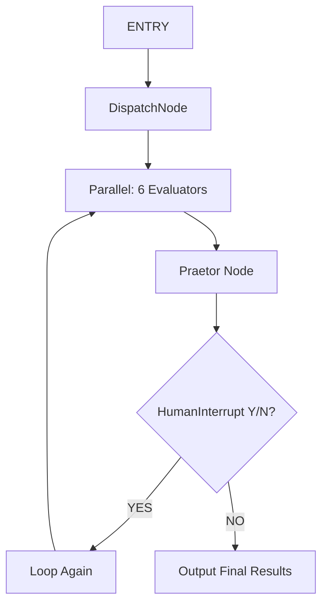

```mermaid
flowchart TD
    A[ENTRY] --> B[DispatchNode]
    B --> C[Parallel: 6 Evaluators]
    C --> D[Praetor Node]
    D --> E{HumanInterrupt Y/N?}
    E -- YES --> F[Loop Again] --> C
    E -- NO --> G[Output Final Results]
```
